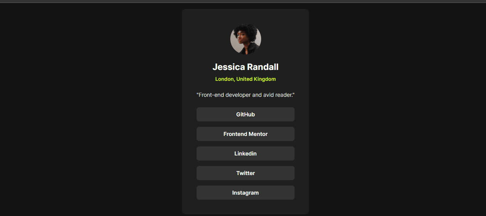

<h1 align="center">Social Links Profile</h1>

Este pequeno projeto é um desafio do FrontEndMentor, consiste numa página de links relacionadas às redes socials do autor.

## Índice

- [Visão Geral](#visão-geral)
- [Funcionalidades](#funcionalidades)
- [Demo](#demo)
- [Contato](#contato)

## Visão Geral

Site de um desafio do FrontEndMentor, utilizando HTML e CSS. Este projeto é útil para englobar todas as redes da pessoa em apenas um local.

## Funcionalidades

- Visual atrativo e fácil e simples;
- Links das redes redireciona para outra página;
- HTML
- CSS

## Demo

[Link para a demonstração do projeto)](https://bruno-nog.github.io/social-links-profile/)

## Contato

